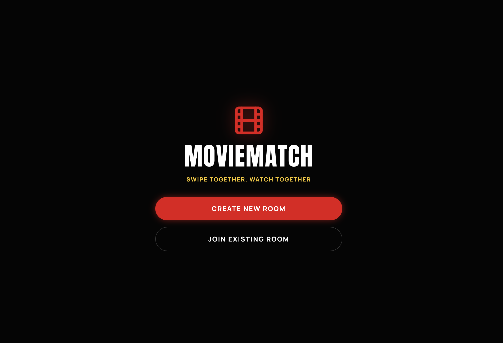

# MovieMatch



MovieMatch is a room-based movie discovery app where friends join a shared session, pick preferences, and swipe through a merged movie list.

## What It Does

- Create or join a room with a short room code.
- Sync room members in real-time with WebSockets.
- Collect preferences from each member before swiping:
	- Genres
	- Languages
	- Release era
- Build one merged movie collection for the whole room (union of member preferences).
- Swipe left/right and detect group matches in real time.

## Tech Stack

- Backend: FastAPI + Motor (MongoDB) in `backend/server.py`
- Frontend: React (CRA + CRACO) in `frontend/`
- Realtime: WebSocket endpoint at `/api/ws/{room_code}`
- Data store: MongoDB (`rooms`, `swipes`, `matches`)

## Project Structure

```
backend/
	server.py
	requirements.txt
frontend/
	src/App.js
	package.json
	public/index.html
run_app.sh
```

## Prerequisites

- Python 3.10+
- Node.js 18+
- npm 9+
- MongoDB running locally on `localhost:27017`

macOS (Homebrew) quick install for MongoDB:

```bash
brew tap mongodb/brew
brew install mongodb-community
brew services start mongodb-community
```

## Environment Setup

Create `backend/.env`:

```env
MONGO_URL=mongodb://localhost:27017
DB_NAME=moviematch
CORS_ORIGINS=http://localhost:3000
```

Optional frontend env in `frontend/.env`:

```env
REACT_APP_BACKEND_URL=http://localhost:8000
```

## Run the App

### One command (recommended)

From repo root:

```bash
./run_app.sh
```

This starts backend and frontend with the expected local configuration.

### Manual run

Backend:

```bash
python3 -m venv .venv
source .venv/bin/activate
pip install -r backend/requirements.txt
pip install uvicorn fastapi motor python-dotenv websockets wsproto
python -m uvicorn backend.server:app --reload --host 0.0.0.0 --port 8000 --env-file backend/.env
```

Frontend:

```bash
cd frontend
npm install
REACT_APP_BACKEND_URL=http://localhost:8000 npm start
```

App URLs:

- Frontend: `http://localhost:3000`
- Backend API: `http://localhost:8000/api`

## API Highlights

- `POST /api/rooms/create`
- `POST /api/rooms/join`
- `POST /api/rooms/start`
- `POST /api/rooms/preferences`
- `GET /api/rooms/{room_code}/movies`
- `POST /api/swipe`
- `GET /api/matches/{room_code}`
- `GET /api/genres`
- `GET /api/languages`
- `GET /api/eras`

## Current Data Behavior

- Catalog is expanded to a large in-memory dataset for variety.
- Poster reliability is hardened with validated poster links and fallback handling.
- Trailer links open from 30 seconds by default.

## Troubleshooting

### `uvicorn: command not found`

Use the venv Python module form:

```bash
.venv/bin/python -m uvicorn backend.server:app --reload --host 0.0.0.0 --port 8000 --env-file backend/.env
```

### `yarn: command not found`

Use npm instead:

```bash
cd frontend
npm install
npm start
```

### Create room fails with DB timeout

Ensure MongoDB is running:

```bash
brew services start mongodb-community
```

### WebSocket not upgrading

Install WebSocket runtime deps in venv:

```bash
pip install websockets wsproto
```

## GitHub Push Checklist

- Configure identity:

```bash
git config user.name "Your Name"
git config user.email "you@example.com"
```

- Commit and push:

```bash
git add -A
git commit -m "Update MovieMatch"
git push -u origin main
```
